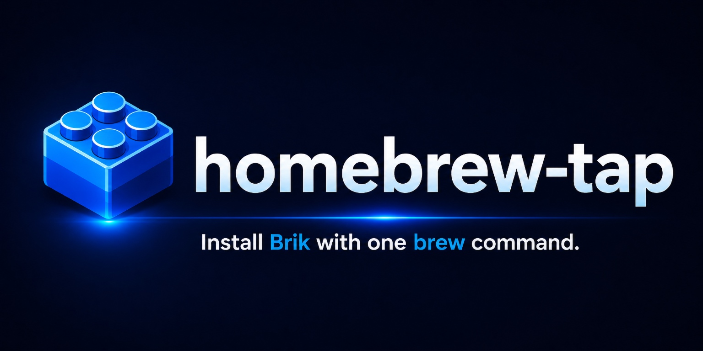

<p align="center">
  
</p>

<p align="center">
  <b>Install Brik with one brew command.</b><br>
  The official Homebrew tap. macOS and Linux, auto-bumped to every Brik release.<br>
  <i>Run your pipeline before you push.</i>
</p>

<p align="center">
  <a href="https://github.com/getbrik/homebrew-tap/actions/workflows/ci.yml"></a>
  <a href="https://github.com/getbrik/brik/releases"></a>
  <a href="#install"></a>
  <a href="https://github.com/getbrik/brik/blob/main/LICENSE"></a>
</p>

<p align="center">
  <a href="https://github.com/getbrik/brik#readme">Brik</a> -
  <a href="https://github.com/getbrik/brik/blob/main/docs/README.md">Documentation</a> -
  <a href="https://github.com/getbrik/homebrew-tap/issues">Issues</a>
</p>

---

## What this tap is

This is the official Homebrew tap for [Brik](https://github.com/getbrik/brik), the
portable CI/CD pipeline system. It exists for one job: get the `brik` CLI onto your
machine, on macOS or Linux, with a single command and the right prerequisites
(`bash 5+`, `yq`, `jq`) already in place.

The point of installing it locally is reproducibility. Brik is the same Bash code
path everywhere, so a `brik` run on your laptop executes what your pipeline executes
on GitLab, Jenkins, or GitHub Actions. You catch a broken build at your desk, not in
CI. Once installed you can:

- scaffold a new project: `brik init`
- validate a `brik.yml` against the schema: `brik validate`
- check the host has the prerequisites: `brik doctor`
- run a single stage or the full CI flow locally: `brik stage <name>` / `brik integrate`
- inspect what the platform-aware planner would run for the current commit: `brik plan --explain`

> [!NOTE]
> This repository ships the formula only. For what Brik is, the fixed flows, the
> supported stacks, and the platform adapters, see the
> [main Brik repository](https://github.com/getbrik/brik).

## Install

```bash
brew install getbrik/tap/brik
```

Or tap first, then install (handy if you plan to add more `getbrik` formulae later):

```bash
brew tap getbrik/tap
brew install brik
```

### Latest development version

To track the unreleased `main` branch instead of the latest tagged release, install
from `--HEAD`:

```bash
brew install --HEAD getbrik/tap/brik
```

> [!TIP]
> A `--HEAD` install pins to the commit it was built from. To pull newer commits
> later, refresh it with `brew upgrade --fetch-HEAD brik` (plain `brew upgrade`
> leaves HEAD installs untouched). Switch back to stable any time with
> `brew install brik` (or `brew reinstall brik`).

#### Running an unmerged feature branch

To exercise a branch that is not yet on `main`, clone the Brik repo, check the
branch out, and alias `brik` to the checkout. `bin/brik` resolves `BRIK_HOME`
from its own location, so no build or install step is needed:

```bash
git clone https://github.com/getbrik/brik.git
cd brik
git checkout <branch-name>
alias brik="$(pwd)/bin/brik"   # add to your shell profile to persist
brik version
```

The alias always reflects whatever branch is currently checked out, so editing
the branch takes effect immediately with no reinstall. Drop the alias (or open a
new shell) to fall back to your Homebrew-installed `brik`.

> [!NOTE]
> If a Homebrew `brik` is on your `PATH` ahead of the alias, the alias still wins
> in interactive shells. Run `which brik` to confirm which one resolves.

## What's in the tap

| Formula | Tracks | Pulls in | License |
|---------|--------|----------|---------|
| `brik` | the [latest Brik release](https://github.com/getbrik/brik/releases) | `bash`, `yq`, `jq` | MPL-2.0 |

The formula installs the Brik runtime under the Homebrew prefix and puts a thin
`brik` shim on your `PATH`, so `BRIK_HOME` is wired up for you and the CLI resolves
its libraries without any extra setup.

## Verify the install

```bash
brik version     # prints the installed Brik version
brik doctor      # checks bash 5+, yq, jq, jv, and the stack toolchains
```

## Next steps

Everything after install lives in the Brik repository:

| You use | Start here |
|---------|------------|
| Local CLI | [Getting started - Local](https://github.com/getbrik/brik/blob/main/docs/getting-started/local.md) |
| GitLab CI | [Getting started - GitLab](https://github.com/getbrik/brik/blob/main/docs/getting-started/gitlab.md) |
| Jenkins | [Getting started - Jenkins](https://github.com/getbrik/brik/blob/main/docs/getting-started/jenkins.md) |

- [Configuration reference](https://github.com/getbrik/brik/blob/main/docs/reference/configuration/README.md) - the full `brik.yml` schema, one page per section
- [Examples](https://github.com/getbrik/brik/tree/main/examples) - working `brik.yml` files for Node, Java, Python, and .NET
- [The Brik README](https://github.com/getbrik/brik#readme) - what Brik is, the two fixed flows, and why it exists
- [Documentation index](https://github.com/getbrik/brik/blob/main/docs/README.md)

## Upgrade

```bash
brew update && brew upgrade brik
```

Every new [Brik release](https://github.com/getbrik/brik/releases) ships with a
matching formula bump in this tap. Run `brew update` regularly to stay current.

## Uninstall

```bash
brew uninstall brik
brew untap getbrik/tap   # optional: remove the tap
```

## Related projects

- [brik](https://github.com/getbrik/brik) - the portable CI/CD pipeline system this tap installs.
- [brik-images](https://github.com/getbrik/brik-images) - official Docker images for Brik runners. Multi-arch, signed, scanned, rebuilt weekly.
- [briklab](https://github.com/getbrik/briklab) - local Docker infrastructure for testing Brik pipelines against real GitLab and Jenkins.

## License

[MPL-2.0](https://github.com/getbrik/brik/blob/main/LICENSE), inherited from the
[Brik project](https://github.com/getbrik/brik).
